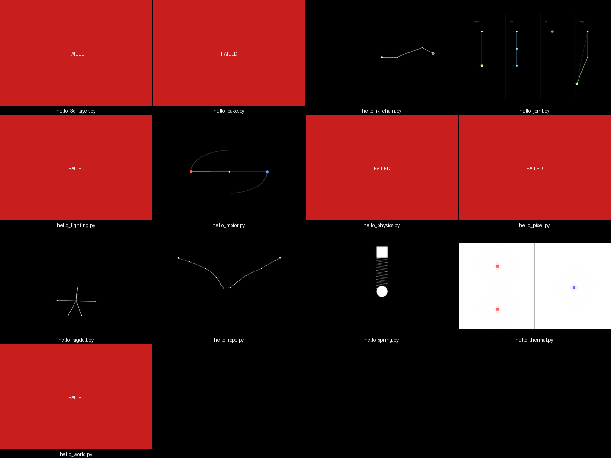

# SlapPyEngine

**2D pixel-art game engine with optional 3D layers, a Rust core, and wgpu rendering.**

Build expressive 2D games in Python — from classic pixel-art shooters to hybrid 2D/3D worlds — backed by a Rust `_core` extension (PyO3 / maturin) and cross-platform GPU rendering via wgpu. The v0.3 line widens the public surface from physics + render kernels to a full game-side contract: dynamics, zones, topology, numerics, thermal, iso, telemetry, and a visual-regression testing harness.

---

## Install

```bash
pip install slappy-engine
```

Requires Python 3.11+ and a GPU driver that supports Vulkan, Metal, or DirectX 12.

Optional extras:

```bash
pip install slappy-engine[3d]        # 3D layer support
pip install slappy-engine[editor]    # DearPyGui Nova3D editor
pip install slappy-engine[network]   # P2P (Kademlia + ICE hole-punching)
pip install slappy-engine[audio]     # Spatial audio backend
pip install slappy-engine[dev]       # pytest + watchdog for contributors
```

---

## Minimal example

The `slappyengine.studio` helpers wrap world setup, stepping, and GIF capture so a working demo lands in ~15 lines. Below: a 16-segment XPBD rope dropping into a softbody stage and saving to a GIF.

```python
from slappyengine.studio import softbody_stage, record
from slappyengine.dynamics import build_rope

# Stage = world + renderer + view box + dt, with sensible defaults.
stage = softbody_stage(view_box=(-2.0, -1.0, 2.0, 5.0))

# 16-segment rope anchored at the top, falls under gravity.
rope = build_rope(
    stage.world,
    anchor=(0.0, 4.5),
    end=(0.0, 0.5),
    segments=16,
)

# Step the world 180 frames at 60 fps, render each frame, save as GIF.
record(stage, frames=180, output="rope.gif", fps=30)
```

For richer scenes see `examples/hello_composite.py` (iso combat + rope + zones + thermal in one scene) and [`docs/studio_quickstart.md`](docs/studio_quickstart.md).

---

## Public subpackages (v0.3)

Every entry below is a top-level lazy export — `import slappyengine as sle` and reach into `sle.dynamics`, `sle.zones`, etc. The auto-generated surface map lives at [`docs/engine_surface_v030.md`](docs/engine_surface_v030.md) (75 symbols across 19 subpackages).

| Subpackage | One-line description |
|---|---|
| [`slappyengine.dynamics`](docs/dynamics_design.md) | Unified XPBD primitives — `Body`, `Material`, `JointSpec` (7 kinds), `RopeSpec`, `RagdollSpec`, `IKChainSpec`, `Humanoid`, plus `build_rope` / `build_ragdoll` / `solve_ik` / `make_motor` / `make_spring`. JSON round-trip via `save_world` / `load_world`. |
| `slappyengine.topology` | Connected-components / union-find primitives lifted from the bond solver. |
| `slappyengine.numerics` | Generic numerical kernels — `vcycle_poisson`, `sor_smooth`, `compute_residual` (V-cycle hot path is now ~73% raw numpy after the 2.45x speedup at 256x256). |
| `slappyengine.zones` | Generic zone primitives — `RectZone`, `ThresholdZone`, `ZoneManager`. Optional spatial-hash backend (10.9x speedup at 1000 entities). |
| `slappyengine.thermal` | `HeatField` plus `exchange_two_regions` pairwise boundary exchange. |
| `slappyengine.iso` | Isometric 2D-grid-with-Z rendering — `IsoCamera`, `IsoCell`, `IsoEntity`, `IsoGrid`, `IsoScene`, plus an `iso.combat` submodule for tower / melee scenarios. |
| `slappyengine.telemetry` | Low-overhead event emission — 86 ns no-subscriber emit, 6.42x subscriber-dispatch speedup via first-segment bucket index. Design: [`docs/telemetry_design.md`](docs/telemetry_design.md). |
| `slappyengine.testing` | Visual regression harness — `assert_scene_matches`, `render_scene_to_png`, `diff_pngs`, baseline/diff directory constants. |
| [`slappyengine.gi`](docs/architecture_overview.md) | Global illumination — radiance cascades, ReSTIR DI, SVGF denoiser (CPU path + `reset_history()` available). |
| `slappyengine.post_process` | Bloom, GTAO, TAA, vignette, outline, chromatic aberration, DoF, motion blur, tonemap (auto-EV), SSR, volumetric fog, shadow CSM. Preset chains: cinematic / arcade / iso-strategy. |
| `slappyengine.material` | Node-graph materials — `NodeMaterial`, `UVNode`, `PixelColorNode`, math nodes, sim-field / texture sample / final-color / discard nodes. |
| `slappyengine.ui.editor` | DearPyGui Nova3D editor — toolbar, gizmos, Code Mode, property inspector, spawn menu (rope / ragdoll / IK chain), anim graph panel. |
| `slappyengine.tools` | Sprite-anchor / atlas audit utility (`sprite_audit`), perf dashboard, screenshot grid runner. Recipe: [`docs/sprite_audit_recipe.md`](docs/sprite_audit_recipe.md). |

---

## Demo gallery

Every demo under [`examples/`](examples/) is runnable headlessly and renders its final state to a PNG / GIF. `tools/run_examples.py` invokes each `examples/hello_*.py` and composes the grid below.



Regenerate with:

```bash
PYTHONPATH=python python tools/run_examples.py --out docs/screenshots/examples_grid.png
```

A read-only audit of every example on master (status, args, headless behaviour) lives at [`docs/examples_smoke_2026_05_31.md`](docs/examples_smoke_2026_05_31.md).

---

## Design docs

The `docs/` tree carries the long-form references:

- [`docs/architecture_overview.md`](docs/architecture_overview.md) — engine layering and Rust `_core` responsibilities.
- [`docs/dynamics_design.md`](docs/dynamics_design.md) / [`docs/dynamics_quickstart.md`](docs/dynamics_quickstart.md) — XPBD substrate, joint kinds, 10-minute hands-on.
- [`docs/engine_surface_v030.md`](docs/engine_surface_v030.md) — auto-generated v0.3 public surface (regenerate via `scripts/gen_engine_surface_doc.py`).
- [`docs/lighting_presets.md`](docs/lighting_presets.md) — cinematic / arcade / iso-strategy preset chains.
- [`docs/telemetry_design.md`](docs/telemetry_design.md) — telemetry module + bucket-index dispatch.
- [`docs/perf_dashboard.md`](docs/perf_dashboard.md) — per-subsystem perf snapshot.
- [`docs/strip_pass_v2_audit.md`](docs/strip_pass_v2_audit.md) — Phase D dry-run deletion-candidate audit.
- [`docs/tutorial_build_a_game.md`](docs/tutorial_build_a_game.md) — end-to-end game tutorial (10 sections, verified-runnable snippets).
- [`CHANGELOG.md`](CHANGELOG.md) — per-version changes.

---

## Build from source

> Requires: Rust toolchain (stable), Python 3.11+, maturin

```bash
git clone https://github.com/andrewkwatts-maker/SlapPyEngine
cd SlapPyEngine

pip install maturin
maturin develop --extras dev

# Run tests
pytest tests/

# Release wheel
maturin build --release

# Release wheel with 3D support
maturin build --release --features 3d
```

**Windows note:** if maturin fails to locate Python, set `PYO3_PYTHON` explicitly:

```powershell
$env:PYO3_PYTHON = "C:\Users\<you>\AppData\Local\Programs\Python\Python313\python.exe"
maturin develop --extras dev
```

---

## License

MIT — see [LICENSE](LICENSE) for details.
