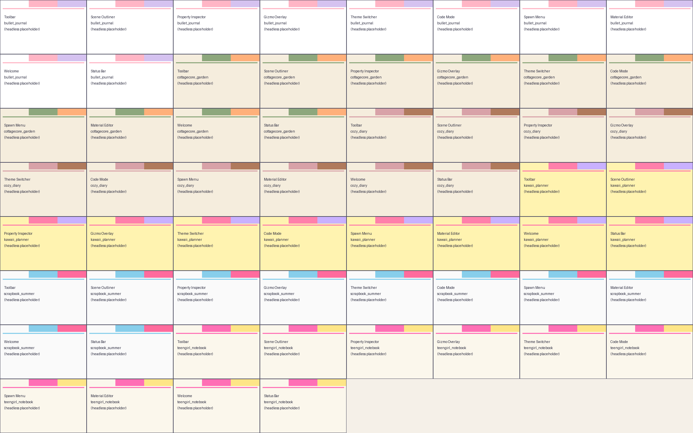

# PharosEngine

*(formerly SlapPyEngine — see [`RENAME_NOTES.md`](RENAME_NOTES.md) for the 2026-07 rename + Rust/Vulkan rewrite summary.)*

**2D pixel-art game engine with a notebook-diary aesthetic editor, a Python game surface, a Rust `_core` backend (5-crate Cargo workspace), a wgpu + Vulkan render backend hosting the Nova3D VCR pipeline, and an [Arithma](https://pypi.org/project/arithma/) symbolic-math sibling.**

## Two wheels

- `pip install pharos-engine`  → headless engine + Rust `_core`. No UI deps.
- `pip install pharos-editor`  → notebook editor UI. Transitively installs `pharos-engine`.

There is also a standalone Rust binary — `pharos-headless` — that renders scenes with **no Python required** (built from the `pharos_bin` crate).

See [`RENAME_NOTES.md`](RENAME_NOTES.md) for the full 10-sprint changelog including VCR pipeline port, GPU compute migration, Nova3D flaw remediation, and the C ABI for future Godot / Unity / JS bindings.

---


Build expressive 2D games in Python — from classic pixel-art shooters to hybrid 2D/3D worlds — driven by the DearPyGui **notebook-diary** editor (six shipped themes, procedural washi-tape / page-lining / edge-stroke shaders, a stationery-tray toolbar, and idle woodland creatures), backed by a Rust `_core` extension (PyO3 / maturin) for hot paths, cross-platform GPU rendering via wgpu, and an optional symbolic-math bridge into the Rust-backed [Arithma](https://pypi.org/project/arithma/) sibling for animation curves, IK targets, and material graphs.

New here? Read [`docs/quickstart.md`](docs/quickstart.md) (5 minutes) then jump to [`docs/ONBOARDING.md`](docs/ONBOARDING.md) for the deeper tour.

---

## Quickstart

```bash
# 1. Install the engine + editor (Dear PyGui + pywebview + Arithma).
pip install "pharos-engine[editor]"

# 2. Verify the install — the ragdoll demo exercises softbody + IK + Rust core.
python SlapPyEngineExamples/examples/hello_ragdoll.py --no-gif

# 3. Boot the notebook-diary editor.
python -c "import pharos_engine as se; se.Engine().run_editor()"
```

Full walkthrough with themes, hotkeys, and prefab drops:
[`docs/quickstart.md`](docs/quickstart.md).

---

## Feature highlights

Sourced from the 2026-07-04 feature-map audit (`docs/engine_feature_map_2026_07_04.md`,
256 rows, 93.0% WIRED / 5.9% STUB / 1.1% BROKEN):

- **Notebook-diary editor** — DearPyGui shell reskinned as a stationery
  tray with a sticker toolbar, bestiary-style outliner, field-journal
  inspector, coloured-pencil gizmos, idle woodland creatures, and a
  27-shortcut hotkey map.
- **6 shipped diary themes** — `teengirl_notebook`, `cozy_diary`,
  `bullet_journal`, `scrapbook_summer`, `cottagecore_garden`,
  `kawaii_planner`; hot-swap losslessly, extendable via
  `~/.pharos_engine/themes/*.theme.yaml`.
- **Procedural stationery shader libraries** — 15 page-lining patterns,
  15 edge-stroke pens/pencils, and 23 washi-tape variants (15 static +
  8 animated, `u_time`-driven).
- **Prefab library** — 6 baked entries (`ball`, `bridge`, `chain`,
  `crate`, `ragdoll`, `windmill`) with a per-user
  `~/.pharos_engine/prefabs/` overlay for edits.
- **Visual scripting** — Notebook Node Editor with 18+ material graph
  nodes, palette + right-click add, WGSL-emitting compile, and
  Python ↔ Graph codegen.
- **Post-process chain manifest** — declarative pass ordering via
  `post_process/executor.py::apply_manifest`; presets ship for
  cinematic / arcade / iso-strategy.
- **Autosave + crash recovery** — background timer snapshots the
  editor state to `~/.pharos_engine/autosave/`; a boot-time
  `RecoveryPrompt` offers to restore newer-than-last-save work.
- **User override layer** — drop `.py` panels, `.yaml` hotkeys,
  `.wgsl` shaders under `~/.pharos_engine/ui/` to extend the editor
  without touching the installed wheel.
- **First-party integration tests** — three shipping games
  (Bullet Strata, Ochema Circuit, Stone Keep) run the engine as
  living regression harnesses.

---

## Repository layout

Top-level Python subpackages under `python/pharos_engine/` — every entry
is a lazy top-level import (`import pharos_engine as sle; sle.dynamics`).
See [`docs/engine_surface_v030.md`](docs/engine_surface_v030.md) for the
auto-generated public symbol map.

```
python/pharos_engine/
├── actions/          # Headless-safe callbacks for editor menu actions (X3 / Y1 idiom).
├── ai/               # LLM client + script generation (httpx-backed, Ollama-compatible).
├── animation/        # Anim-graph nodes, blend trees, IK retargeting hooks.
├── audio_runtime/    # Sounddevice + soundfile backend behind engine.audio.
├── autosave.py       # AutosaveManager + RecoveryPrompt (background snapshotting).
├── build/            # Project scaffolder — `slap new` template writer.
├── compute/          # ComputePass, EffectPipeline, WGSL AST compiler.
├── dynamics/         # Unified XPBD primitives (Body, JointSpec, RopeSpec, RagdollSpec, IK).
├── ext/              # Stable shims for downstream games (Bullet Strata, Ochema Circuit).
├── fluid/            # PBF particle-based fluid (Rust-backed step, Python surface).
├── gi/               # Radiance cascades, ReSTIR DI, SVGF denoiser.
├── gpu/              # GPUContext, render / mesh / texture managers, PBR material.
├── input/            # ActionMap + InputManager (keyboard / mouse / gamepad).
├── iso/              # Isometric 2D-grid-with-Z rendering + iso.combat.
├── material/         # NodeMaterial + material node types (add / lerp / sample / …).
├── math/             # Formula (Arithma bridge), Vec2/3/4, animation curves.
├── net/              # P2P (kademlia DHT + zeroconf LAN) + lockstep sync.
├── numerics/         # Generic numerical kernels (V-cycle Poisson, SOR).
├── physics/          # Broadphase, CCD, particle graph, hulls (WIP subpackage).
├── post_process/     # Bloom / GTAO / TAA / DoF / SSR / shadow CSM + manifest.
├── prefabs/          # PrefabLibrary — 6 baked entries + user overlay.
├── projects/         # Project + registry — `.slap_proj` load/save/recents.
├── residency/        # Disk → RAM → VRAM promotion, .slap binary format.
├── softbody/         # XPBD softbody solver (Rust-backed step).
├── studio.py         # Stage scaffolding — softbody / fluid / humanoid / dynamics + record().
├── telemetry/        # Low-overhead event emission (86 ns no-subscriber emit).
├── testing/          # Visual regression harness (assert_scene_matches, diff_pngs).
├── thermal/          # HeatField + pairwise boundary exchange.
├── tool_router.py    # REGISTRY of ToolAction entries gating every hotkey / spawn / menu.
├── tools/            # sprite_audit, texture / audio / video / track CLIs.
├── topology/         # Connected components / union-find primitives.
├── ui/               # Editor (notebook shell + Nova3D legacy panels) + widgets + theming.
├── visual_scripting/ # 18+ material nodes + Python ↔ Graph codegen.
└── zones/            # RectZone / ThresholdZone / ZoneManager + spatial hash.
```

Rust source under `src/` provides the `_core` extension (softbody, PBF,
IK, hull, raster, node compiler). WGSL shaders live under `shaders/`
(templates) and `python/pharos_engine/compute/defaults/` (default pipelines).
User overrides land at `~/.pharos_engine/`; see
[`docs/user_customization_2026_06_07.md`](docs/user_customization_2026_06_07.md).

---

## What's new in v0.3.0b0

The v0.3 line widens the public surface from physics + render kernels to a full game-side contract: dynamics, zones, topology, numerics, thermal, iso, telemetry, humanoid factories, a `studio` scaffolding layer, and a visual-regression testing harness. Lighting picked up Vogel-disk PCF and screen-space contact shadows; the demo bench grew to 47 hello-* scripts driven by a shared `examples_common` CLI helper. See the [CHANGELOG](CHANGELOG.md#030--2026-05-31), the auto-generated [engine surface reference](docs/engine_surface_v030.md), and the curated [demo gallery](docs/demo_gallery.md).

---

## Install

```bash
pip install pharos-engine==0.3.0b0
```

Requires Python 3.11+ and a GPU driver that supports Vulkan, Metal, or DirectX 12. The headless surface (dynamics, zones, telemetry, materials, serialisation, studio) runs without a GPU.

Optional extras:

```bash
pip install "pharos-engine[3d]"        # 3D layer support
pip install "pharos-engine[editor]"    # DearPyGui Nova3D editor
pip install "pharos-engine[network]"   # P2P (Kademlia + ICE hole-punching)
pip install "pharos-engine[audio]"     # Spatial audio backend
pip install "pharos-engine[dev]"       # pytest + watchdog for contributors
```

---

## Minimal example

`pharos_engine.studio` wraps world setup, stepping, and GIF capture so a working demo lands in ~20 lines. `pharos_engine.examples_common` ships the same `--frames` / `--out` / `--no-gif` CLI plumbing every `hello_*.py` script uses — drop it in and your demo gets a smoke-test mode for free.

```python
from pathlib import Path

from pharos_engine import studio
from pharos_engine.dynamics import RopeSpec, build_rope
from pharos_engine.examples_common import build_demo_arg_parser, record_or_smoke


def build_stage() -> studio.Stage:
    stage = studio.dynamics_stage(
        gravity=(0.0, -9.81),
        solver_iterations=16,
        view_box=(-3.0, -3.0, 3.0, 3.0),
        floor_y=-3.0,
    )
    spec = RopeSpec(node_count=24, total_length=6.0, mass_per_node=0.05,
                    stiffness=2.0e6, damping=0.02,
                    anchor_a_pinned=True, anchor_b_pinned=True)
    build_rope(spec, stage.dynamics, anchor_a=(-2.0, 2.0), anchor_b=(2.0, 2.0))
    return stage


if __name__ == "__main__":
    args = build_demo_arg_parser("Hello rope", default_frames=120).parse_args()
    record_or_smoke(build_stage(), args, default_out=Path("rope.gif"))
```

`record_or_smoke` runs `stage.record(...)` by default and falls back to a step-only smoke loop under `--no-gif`. For richer scenes see [`SlapPyEngineExamples/examples/hello_studio.py`](SlapPyEngineExamples/examples/hello_studio.py), [`SlapPyEngineExamples/examples/hello_composite.py`](SlapPyEngineExamples/examples/hello_composite.py) (iso combat + rope + zones + thermal in one scene), and [`docs/studio_quickstart.md`](docs/studio_quickstart.md).

---

## Public subpackages (v0.3)

Every entry below is a top-level lazy export — `import pharos_engine as sle` and reach into `sle.dynamics`, `sle.zones`, etc. The auto-generated surface map lives at [`docs/engine_surface_v030.md`](docs/engine_surface_v030.md) (75 symbols across 21 subpackages). Each row links to its hand-authored API reference under [`docs/api/`](docs/api/) — 19 hand-authored references plus auto-generated `dynamics.md` and `tools.md`.

| Subpackage | One-line description |
|---|---|
| [`dynamics`](docs/api/dynamics.md) | Unified XPBD primitives — `Body`, `Material`, `JointSpec` (7 kinds), `RopeSpec`, `RagdollSpec`, `IKChainSpec`, plus `build_rope` / `build_ragdoll` / `solve_ik` / `make_motor` / `make_spring`, the `make_humanoid` factory, and JSON round-trip via `save_world` / `load_world`. |
| [`studio`](docs/api/studio.md) | Scene scaffolding — `Stage`, `softbody_stage`, `fluid_stage`, `humanoid_stage`, `dynamics_stage`, `record(...)`. Wrap any rebuild world into a working demo in ~15 lines. |
| [`topology`](docs/api/topology.md) | Connected-components / union-find primitives lifted from the bond solver. |
| [`numerics`](docs/api/numerics.md) | Generic numerical kernels — `vcycle_poisson`, `sor_smooth`, `compute_residual` (~73% raw numpy after the 2.45x V-cycle speedup at 256x256). |
| [`zones`](docs/api/zones.md) | Generic zone primitives — `RectZone`, `ThresholdZone`, `ZoneManager`. Optional spatial-hash backend (10.9x speedup at 1000 entities). |
| [`thermal`](docs/api/thermal.md) | `HeatField` plus `exchange_two_regions` pairwise boundary exchange. |
| [`iso`](docs/api/iso.md) | Isometric 2D-grid-with-Z rendering — `IsoCamera`, `IsoCell`, `IsoEntity`, `IsoGrid`, `IsoScene`, plus an `iso.combat` submodule for tower / melee scenarios. |
| [`telemetry`](docs/api/telemetry.md) | Low-overhead event emission — 86 ns no-subscriber emit, 6.42x subscriber-dispatch speedup via first-segment bucket index. Design: [`docs/telemetry_design.md`](docs/telemetry_design.md). |
| [`testing`](docs/api/testing.md) | Visual regression harness — `assert_scene_matches`, `render_scene_to_png`, `diff_pngs`, baseline/diff directory constants. |
| [`gi`](docs/api/gi.md) | Global illumination — radiance cascades, ReSTIR DI, SVGF denoiser (CPU path + `reset_history()` available). |
| [`post_process`](docs/api/post_process.md) | Bloom, GTAO, TAA, vignette, outline, chromatic aberration, DoF, motion blur, tonemap (auto-EV), SSR, volumetric fog, shadow CSM with Vogel-disk PCF, screen-space contact shadows. Preset chains: cinematic / arcade / iso-strategy. |
| [`material`](docs/api/material.md) | Node-graph materials — `NodeMaterial`, `UVNode`, `PixelColorNode`, math nodes, sim-field / texture sample / final-color / discard nodes. |
| [`animation`](docs/api/animation.md) | Anim-graph nodes, blend trees, IK retargeting hooks. |
| [`compute`](docs/api/compute.md) / [`gpu`](docs/api/gpu.md) / [`residency`](docs/api/residency.md) | GPU compute pipeline, mesh / texture managers, SLAP residency cache. |
| [`audio_runtime`](docs/api/audio_runtime.md) | Backend abstraction (sounddevice + soundfile or silent stub) behind `engine.audio`. |
| [`ui.editor`](docs/api/ui_editor.md) | DearPyGui Nova3D editor — toolbar, gizmos, Code Mode, property inspector, spawn menu (rope / ragdoll / IK chain), anim graph panel. |
| [`tools`](docs/api/tools.md) | Sprite-anchor / atlas audit utility (`sprite_audit`), perf dashboard, screenshot grid runner. Recipe: [`docs/sprite_audit_recipe.md`](docs/sprite_audit_recipe.md). |
| [`ext`](docs/api/ext.md) | Stable shims for downstream games (Bullet Strata, Ochema Circuit) — pinned import paths for legacy modules. |

---

## Demo gallery

Every script under [`SlapPyEngineExamples/examples/`](SlapPyEngineExamples/examples/) is runnable headlessly via the shared `examples_common` CLI helper — pass `--no-gif` for a smoke test, `--render` (or no flag) for the GIF / PNG output. The curated tour with reproducible commands, refreshed artefacts, and one-line summaries lives at [`docs/demo_gallery.md`](docs/demo_gallery.md) (6 flagship demos: ragdoll, studio one-liner, humanoid walking, IK terrain, rope, GI).

For the full 47/47 GREEN pass/fail audit see [`docs/examples_smoke_2026_06_01_v3.md`](docs/examples_smoke_2026_06_01_v3.md). The composite grid is regenerated with:

```bash
PYTHONPATH=python python tools/run_examples.py --out docs/screenshots/examples_grid.png
```

---

## Performance

Headline numbers from the v0.3.0b0 perf bench ([full report](benchmarks/baseline_report.md)):

| Subsystem | Throughput / cost | Notes |
|---|---|---|
| Fluid (PBF, end-to-end) | **1176 fps** | Post Rust migration Tiers 1-10; particle Scenario B reference. |
| Softbody (XPBD rope-20, end-to-end) | **544 fps** | Same Rust-core baseline; `softbody_world_step_20n` pinned at 0.699 ms. |
| `_pbf_bridge_step` (Scenario B combined) | **-16.1% vs prior baseline** | Sprint 5A YAML `_fresh_world_config` `lru_cache` win; 40.80 ms → 34.41 ms (v3 refresh). |
| Hardening validators (rounds 7-10) | **< 5% frame-budget overhead** | Every public entry point (World.step / .add_node, EventBus.publish, AudioManager.play) audited; no `_DEBUG_VALIDATE` gate needed. |

See [`docs/perf_dashboard.md`](docs/perf_dashboard.md) for the per-subsystem tripwire snapshot and [`benchmarks/baseline_report.md`](benchmarks/baseline_report.md) for the full Scenario A/B/C breakdown including the 3-run stability tables.

---

## Editor (the notebook)

SlapPyEngine ships a Dear PyGui editor reskinned as a **diary notebook** — a stationery-tray toolbar of rubber stamps, a bestiary-style scene outliner, a field-journal property inspector, coloured-pencil gizmos, and a small cast of woodland creatures that idle in the corners. Six diary themes ship in the box (`teengirl_notebook`, `cozy_diary`, `bullet_journal`, `scrapbook_summer`, `cottagecore_garden`, `kawaii_planner`) and hot-swap losslessly.



The full panel-by-panel tour, hotkey table, customisation walkthrough, and accessibility settings live in [`docs/notebook_editor_manual_2026_06_03.md`](docs/notebook_editor_manual_2026_06_03.md). Reference screenshots are regenerated with:

```bash
PYTHONPATH=python python scripts/capture_notebook_screenshots.py --all
```

---

## Roadmap

Near-term, mid-term, and v1.0 candidates — see [`docs/roadmap.md`](docs/roadmap.md).

---

## Design docs

The `docs/` tree carries the long-form references:

- [`docs/getting_started.md`](docs/getting_started.md) — 15-minute first-game walkthrough.
- [`docs/studio_quickstart.md`](docs/studio_quickstart.md) — 5-minute tour of the `studio` scaffolding helpers.
- [`docs/dynamics_quickstart.md`](docs/dynamics_quickstart.md) / [`docs/dynamics_design.md`](docs/dynamics_design.md) — XPBD substrate, joint kinds, 10-minute hands-on + deep design rationale.
- [`docs/demo_gallery.md`](docs/demo_gallery.md) — curated tour of flagship demos (artefacts checked in).
- [`docs/architecture_overview.md`](docs/architecture_overview.md) — engine layering and Rust `_core` responsibilities.
- [`docs/engine_surface_v030.md`](docs/engine_surface_v030.md) — auto-generated v0.3 public surface (regenerate via `scripts/gen_engine_surface_doc.py`).
- [`docs/lighting_presets.md`](docs/lighting_presets.md) — cinematic / arcade / iso-strategy preset chains.
- [`docs/telemetry_design.md`](docs/telemetry_design.md) — telemetry module + bucket-index dispatch.
- [`docs/perf_dashboard.md`](docs/perf_dashboard.md) — per-subsystem perf snapshot.
- [`docs/tutorial_build_a_game.md`](docs/tutorial_build_a_game.md) — end-to-end game tutorial (10 sections, verified-runnable snippets).
- [`docs/roadmap.md`](docs/roadmap.md) — what's next: near-term (v0.3.x), mid-term (v0.4), long-term (v1.0).
- [`docs/CONTRIBUTING.md`](docs/CONTRIBUTING.md) — contributor conventions (hardening pattern, doc markers, naming, post-process pass authoring).
- [`CHANGELOG.md`](CHANGELOG.md) — per-version changes.

---

## Build from source

> Requires: Rust toolchain (stable), Python 3.11+, maturin

```bash
git clone https://github.com/andrewkwatts-maker/SlapPyEngine
cd SlapPyEngine

pip install maturin
maturin develop --extras dev

# Run tests
pytest SlapPyEngineTests/tests/

# Release wheel
maturin build --release

# Release wheel with 3D support
maturin build --release --features 3d
```

**Windows note:** if maturin fails to locate Python, set `PYO3_PYTHON` explicitly:

```powershell
$env:PYO3_PYTHON = "C:\Users\<you>\AppData\Local\Programs\Python\Python313\python.exe"
maturin develop --extras dev
```

---

## License

MIT — see [LICENSE](LICENSE) for details.
